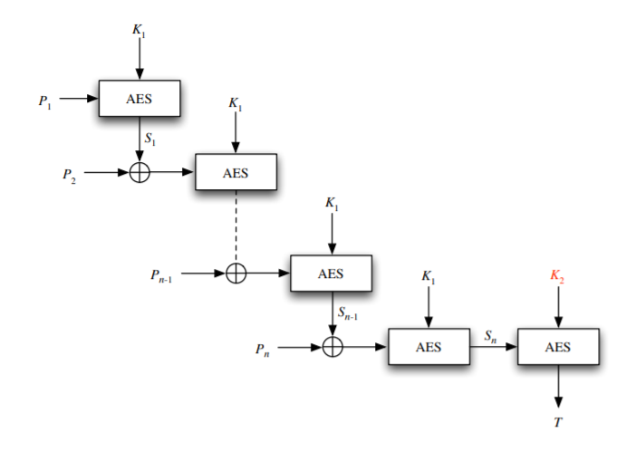

# MACs

The reason that cryptographic hash functions do not provide authenticity is because they are not keyed functions. A **message authentication code** is a function `F(K, M)` that produces a fixed length bit string from a variable length message `M` given a key `K`. In other words, a MAC can be roughly thought as a "keyed hash function."

We say that a MAC is secure if attackers cannot forge the MAC of some message \(of their choosing\) without knowing the key `K`. This can be expressed in a security game where a \(polynomial-time\) adversary queries the challenger for MACs of messages and then takes a guess. However, in this security game, the adversary is not allowed to guess the MAC of any message they have queried before.

## Building Secure MACs

One way to build a MAC is to chain a bunch of AES block ciphers together, like so: 

Here, the key `K` for the MAC is the pair `(K_1, K_2)`. This MAC is called **AES-EMAC**. AES-EMAC is a secure MAC assuming that AES is a secure block cipher.

Another way to build a secure MAC is to use a cryptographic hash function `H`. Given `H`, we can define:

$$
F(K, M) = H \left((K \oplus \text{opad})|H\left((K \oplus \text{ipad}) | M\right)\right)
$$

Here, `opad` and `ipad` are different block-sized constants. MACs built in this manner are called HMACs. HMACs have the additional property that they are preimage and collision-resistant even if the attacker has the key `K` \(not hard to show assuming `H` is a cryptographic hash\). Thus, HMACs fully live up to name "keyed hash functions."


MACs are not IND-CPA secure. That is, they can leak partial information. Therefore, if one is doing encryption, one should apply the MAC to the ciphertext, not the plaintext.


